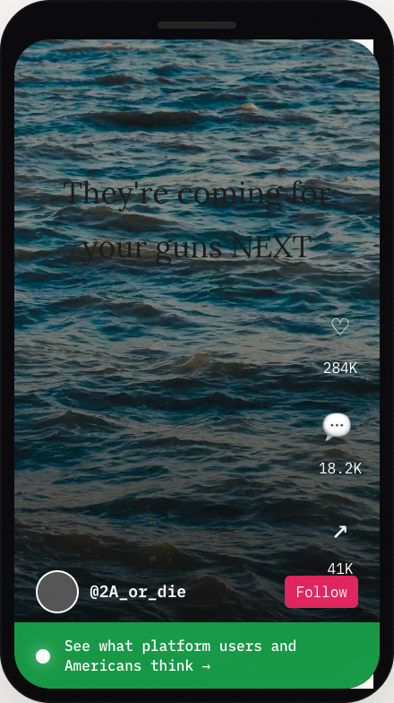
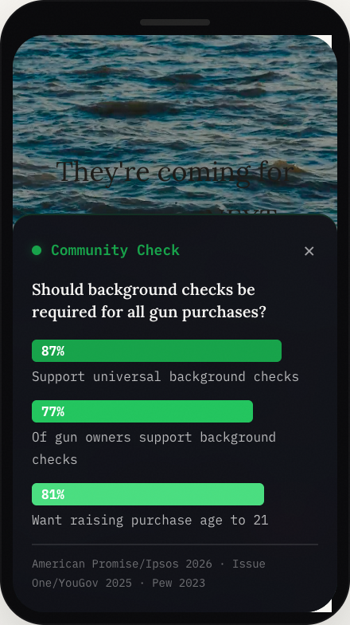
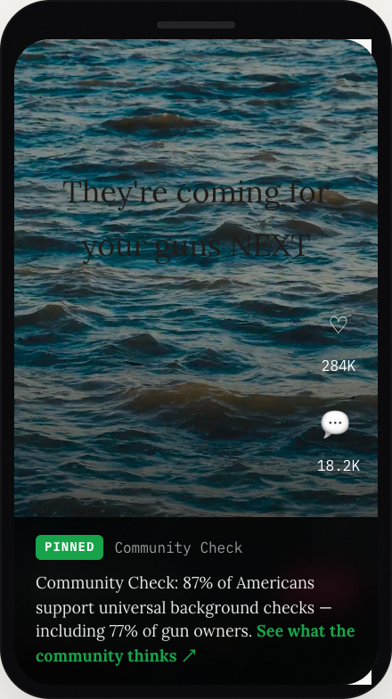

# Community Check — Design Reference

Visual reference for the Community Check specification. These mockups show what the intervention looks like in practice.

## The core interaction

A small, unobtrusive link beneath high-reach posts on contested policy topics:

Tapping the link reveals representative opinion data — both from platform users (random sample) and from peer-reviewed national polls:

## Short-form video adaptation

The same intervention adapted for TikTok, Reels, and Shorts. A small green indicator appears at the bottom of qualifying videos once they cross the reach/engagement thresholds:

Swiping up reveals the full opinion data without leaving the video player — with larger type, tighter vertical layout, and bars optimized for glance-readability:

For platforms where swipe interactions aren't available, Community Check can attach as an auto-pinned comment instead:

See the [technical spec](../docs/technical-spec.md#short-form-video-adaptation) for classification, trigger thresholds, and latency strategies specific to video.

## The data pipeline

How posts become Community Checks — from viral trigger through topic classification to the two-tier data lookup:

## Design principles

- **Conservative triggering.** The system stays silent when uncertain. Gaps are better than false matches.
- **Non-directional.** Community Check shows what people think — it never tells the user what to think.
- **Everyone sees the same numbers.** No personalization. No filtering by social graph. No engagement-based adjustment.
- **Unobtrusive.** Below the post, never on top of it. A quiet link, not a label or warning.
- **Two signals, side by side.** Platform sample (Tier 2) and national polls (Tier 1) are shown together because they correct different distortions.

## Files

| File | Purpose |
|------|---------|
| `mockup-collapsed.png` | Post with Community Check prompt attached |
| `mockup-expanded.png` | Full opinion data reveal |
| `video-mockup-indicator.png` | Short-form video with CC indicator |
| `video-mockup-expanded.png` | Short-form video with expanded CC |
| `video-mockup-pinned.png` | Pinned-comment variant |
| `pipeline-flow.svg` / `.png` | Data and control flow diagram |
| `og-image.png` | Social preview card |

All mockups are rendered from the interactive essay at [thenoisyroom.com](https://thenoisyroom.com).
