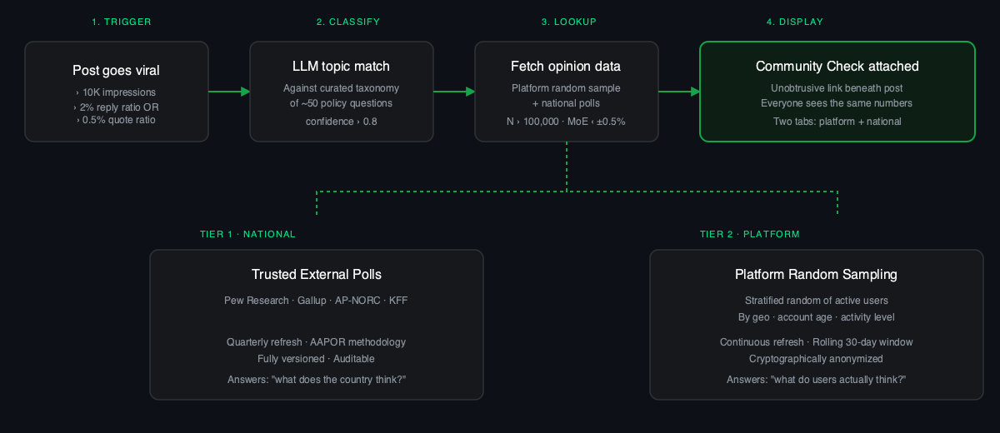
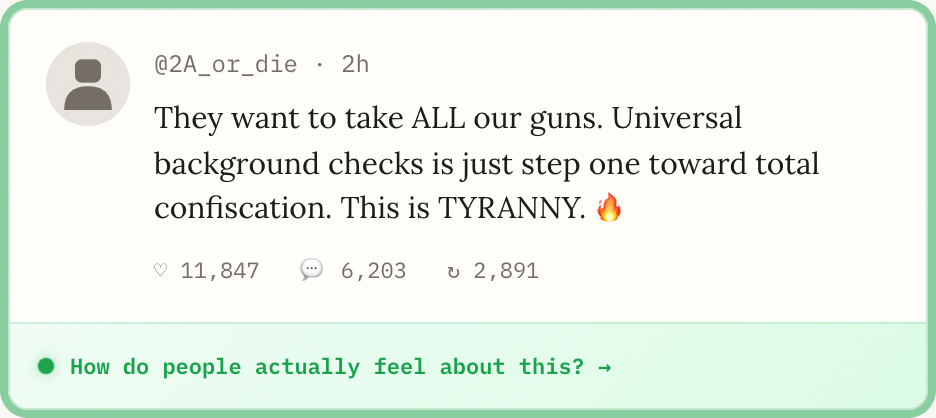
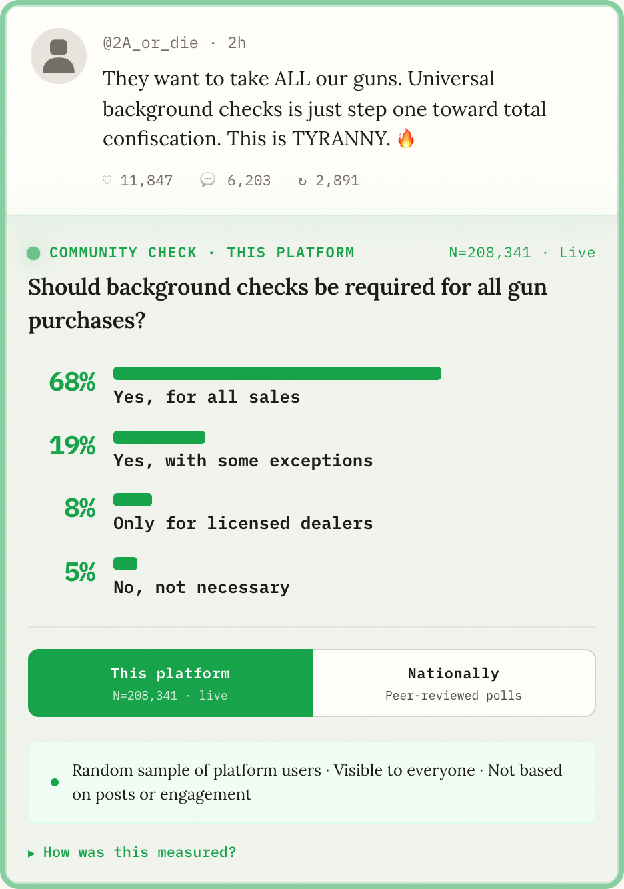

# Technical Specification

> *This design builds on the bridging-based consensus work pioneered by Audrey Tang and vTaiwan, the crowd-sourced bridging algorithms developed by the authors of Community Notes, and Steven Pinker's analysis of common knowledge as a lever for collective behavior change.*

Community Check is a two-tier data system that attaches representative public opinion to high-reach social media posts. This document covers the full architecture.

The UI attaches to qualifying posts like this:

And expands to show representative opinion data:

## Data Architecture

Community Check draws from two independent data sources, shown side-by-side so users can compare what this platform's users think versus what Americans think nationally.

### Tier 1: Trusted External Polls

Gold-standard, nationally representative surveys from established providers:

- **Pew Research Center** — ongoing social/political tracking
- **Gallup** — longest-running U.S. opinion polling
- **AP-NORC** — Associated Press + NORC at UChicago
- **KFF** — health policy polling

Quarterly refresh cycle. Each data point linked to published methodology. Auditable and versioned.

### Tier 2: Platform Random Sampling

Real-time polling of platform users via stratified random sampling.

**Who gets sampled:** A random selection from all active accounts (logged in within 30 days). Not based on posting history, engagement, or follower count. A lurker with 3 followers has the same selection probability as an influencer with 3 million.

**How they're selected:** Stratified random sampling — the user base is divided into strata by geography (state/region), account age (new vs. established), and activity level (daily vs. weekly). Random draws are taken from each stratum proportionally, ensuring the sample mirrors the platform's actual user demographics, not its loudest demographics.

**What they're asked:** Short, neutrally worded policy questions — never framed toward a particular answer. Example: "Should there be limits on money spent on political campaigns?" not "Do you support stopping corruption in politics?" Questions are developed and reviewed by the polling consortium's editorial board.

**How they respond:** Users receive an in-app prompt (similar to existing satisfaction surveys platforms already run). Responses are optional. Non-response bias is mitigated by oversampling underrepresented strata and weighting results to match known platform demographics.

**Anonymity:** Responses are cryptographically anonymized at the point of collection. The system records the response and the stratum it came from — never the user ID. Responses cannot be linked back to profiles, posts, or browsing behavior.

**Sample size:** Targets N>100,000 per question for major topics, producing margins of error below ±0.5%. For context, most national polls use N=1,000–2,000. The platform sample is 50–100x larger.

**Refresh cycle:** Continuous — new respondents are sampled daily. Results reflect a rolling 30-day window, automatically aging out old responses. This means the data tracks real shifts in opinion, not a single snapshot.

**Preventing gaming:** Each user can only respond once per question per 90-day cycle. Responses are rate-limited and anomaly-detected — coordinated response patterns (e.g., 10,000 identical responses from accounts created the same week) are flagged and excluded. The sampling algorithm itself is the primary defense: you can't game a system that chooses respondents randomly and doesn't tell you when you'll be chosen.

**Open-source and auditable:** The sampling algorithm, weighting methodology, and anomaly detection rules are published as open-source code. Independent researchers can audit the full pipeline from sampling frame to displayed result. Quarterly transparency reports publish response rates, demographic breakdowns, and any excluded anomalies.

**What everyone sees:** All users see the same results for the same question. The numbers are not personalized, not filtered by your social graph, and not adjusted based on your engagement history. This is the critical difference from everything else in the feed.

---

## Topic Classification

Mapping posts to poll questions. This is the hardest technical problem in Community Check — and modern LLMs make it tractable.

### Step 1: Curated Question Taxonomy

~50–100 neutrally worded policy questions, each linked to polling data. Examples:

- "Should background checks be required for all gun purchases?"
- "Should there be limits on money spent on political campaigns?"
- "Should the U.S. take significant action on climate change?"

Questions are governed by bridging-based approval (see [Data Sources & Governance](#data-sources--governance)). The taxonomy starts small and expands conservatively.

### Step 2: LLM-Based Post Classification

When a post meets the trigger criteria (reach + engagement + topic signal), an LLM call classifies it against the taxonomy:

- **Input:** Post text, any quoted/linked content, author context (topic history), thread context if a reply
- **Prompt structure:** "Given this post, which of the following policy questions (if any) is it primarily discussing? Return the question ID and a confidence score from 0–1. If no question is a strong match, return null."
- **Model:** A fine-tuned classifier or a general-purpose LLM (GPT-4 class). Platforms already run models of this capability for content moderation and ad targeting.
- **Confidence threshold:** Match confidence must exceed 0.8 to attach a Community Check. At this threshold, expect ~90%+ precision — the system stays silent when uncertain.

### Step 3: Multi-Agent Verification (High-Stakes Posts)

For posts approaching viral thresholds (>100K impressions), a second independent classification pass runs:

- Two independent LLM calls with different prompt framings classify the same post
- Both must agree on the matched question and both must exceed 0.8 confidence
- **Disagreement → no match.** If the two classifiers disagree, the post gets no Community Check. Conservative by design.
- **Edge case flagging:** Posts that receive one match and one null are flagged for human review, building training data for future improvements.

### Step 4: User Feedback Loop

Users who interact with a Community Check can flag mismatches ("This post isn't about gun policy"). This feedback is:

- Aggregated and weighted (bridging-based: flags from users who normally disagree carry more weight)
- Used to retrain/fine-tune the classifier on real-world edge cases
- Published in quarterly transparency reports: match rates, flag rates, correction rates

### Known Hard Cases

- **Sarcasm and irony:** "Sure, let's just give everyone a gun" — the classifier doesn't need to determine the poster's stance (Community Check is non-directional), but it does need to identify the topic. LLMs are significantly better at topic detection than stance detection.
- **Multi-topic posts:** A post about "immigration and the economy" could map to either taxonomy. The system picks the strongest match above 0.8, or returns null if ambiguous.
- **Evolving language:** Slang, coded language, and memes shift faster than classifiers update. The user feedback loop and quarterly retraining address this, but there will always be a lag.

The taxonomy is intentionally small. The goal is not to cover every opinion — it's to cover the topics where perception gaps are largest and best documented.

---

## Trigger Criteria

Not every post needs context. Community Check activates when a post meets **all three criteria**:

| Criterion | Threshold | Rationale |
|-----------|-----------|-----------|
| Reach | >10K impressions | Post is being seen widely enough to shape perception |
| Engagement heat | Reply ratio >2% OR quote ratio >0.5% | Disproportionate reaction — emotional rather than informational processing |
| Topic match confidence | >0.8 | Classifier has high confidence the post maps to a curated poll question |

This means most posts — casual conversation, photos, jokes — are never touched. Community Check only appears on high-reach, high-heat posts about contested policy topics where perception gaps are documented.

The thresholds are tunable. Platforms could start conservative (higher thresholds) and expand based on user reception data.

---

## Data Sources & Governance

Community Check can work at two levels, and the ideal system uses both.

### Starting Point: Curated Third-Party Polls

An open-source implementation can launch immediately by aggregating existing peer-reviewed polling data:

- **Trusted sources:** Pew, Gallup, AP-NORC, KFF, and similar organizations with published methodology and AAPOR-standard reporting
- **Standardized format:** Each data point includes: question text, sample size, margin of error, methodology, date of fieldwork, and raw crosstabs
- **Versioned and auditable:** Every data update is logged with full provenance. The full pipeline from survey to displayed number is open to inspection
- **Multiple polls per topic:** Users can tab between different polls on the same issue, seeing different wordings and providers — transparency about how framing affects results

### Ideal: Platform-Native Polling with Bridging-Based Governance

The strongest version runs directly on the platform, using a bridging algorithm to govern which questions are asked — similar to how Community Notes uses bridging to surface notes that earn agreement across ideological divides:

- **Question proposal:** Questions are proposed by a diverse pool of contributors (researchers, journalists, citizens) — not by the platform itself
- **Bridging-based approval:** A question only enters the active taxonomy if it receives approval from contributors who historically disagree with each other. This filters out loaded or partisan questions structurally, without relying on any single editorial board
- **Conservative triggering:** Questions activate only when the match confidence is high (>0.8) and the post meets reach + engagement thresholds. The system is designed to stay silent when uncertain — gaps are better than false matches
- **Platform-native sampling:** The platform runs its own stratified random sample of users, producing real-time data at N>100,000 with margins of error below ±0.5%
- **Open-source algorithm:** The sampling algorithm, bridging model, and question taxonomy are all published. Independent researchers can audit every layer

The bridging approach solves the "who decides?" problem without relying on any single institution. Neutrality emerges from the structure of the system, not from the good intentions of its operators.

### How Bridging Selects Question Framings

Question framing is the single highest-leverage decision in the entire system. *"Should background checks be required for all gun purchases?"* and *"Should the government require permission to buy a firearm?"* measure ostensibly the same policy attitude — but consistently produce different numbers. If Community Check picks the wrong framing, the displayed consensus is itself a distortion.

A bridging algorithm — adapted from the Community Notes design ([Wojcik et al., 2022](https://arxiv.org/abs/2210.15723)) — solves this by structurally requiring cross-ideological approval before a framing enters production. Here's how it works in practice:

**1. Open question proposal.** Any contributor in the pool (researchers, journalists, citizens, civil society organizations) can submit a candidate framing for a topic. Each submission includes:

- The exact question text
- Source poll(s) that have used identical or near-identical wording
- A short rationale for why this wording is neutral
- A list of the answer options it permits

**2. Diverse rater pool.** Contributors are profiled by their *historical rating behavior*, not by self-declared affiliation. The bridging model learns which raters tend to approve which questions. Two raters who consistently approve the same questions are clustered as "ideologically similar"; two who consistently disagree are clustered as "ideologically distant." This is a learned latent variable, not a self-report.

**3. Bridging score for each candidate framing.** For a candidate question to be approved, it must achieve a *bridging score* — a measure of how much it earns approval across rater groups that don't usually agree. A question that gets 100% approval from one cluster and 0% from another scores poorly, regardless of its absolute approval rate. A question that earns moderate approval across all clusters scores highly. This is mathematically the same approach Community Notes uses to surface notes that "find common ground."

**4. Adversarial probes.** Before deployment, candidate framings are tested against deliberately loaded variants. If the bridging algorithm cannot distinguish the candidate from a clearly biased version (e.g., a candidate paired with *"Should we close the loophole that lets dangerous people buy guns?"*), the candidate is rejected. This prevents subtle priming effects from slipping through.

**5. Multiple framings per topic.** Where bridging produces several near-equivalent candidates, *all of them* are kept and rotated. Users in the expanded view can see the percentage breakdown for each individual framing. This is itself transparency — the median across qualifying polls becomes the headline number, but the underlying variance is visible.

**6. Periodic re-validation.** Language drifts. A framing that was neutral in 2026 may carry partisan connotations by 2030. Approved framings are re-rated quarterly by the bridging pool; if a previously-approved question's bridging score falls below threshold, it's deprecated and removed from rotation.

**Selection criteria for the contributor pool itself.** The bridging algorithm is only as good as the diversity of its raters. Bootstrapping the pool requires explicit recruitment from groups that would otherwise be underrepresented:

- Active contributors are surveyed quarterly to map the pool's actual distribution across multiple dimensions (partisan identity, ideological score, demographic characteristics, geographic spread)
- Imbalances trigger targeted outreach to underrepresented groups
- A minimum threshold of cross-ideological raters is required before any new question can earn approval — small or homogeneous pools cannot promote framings until diversity is restored
- Contributor reputation is tracked via the bridging model itself: contributors whose ratings consistently align with the cross-cluster consensus gain weight; those whose ratings are highly partisan but rarely bridging gain less

**What this prevents:**

- *Loaded framings* ("the gun loophole" vs. "private sale exception") — both flagged as partisan-coded, neither approved
- *False neutrality* — a framing that sounds neutral to one cluster but signals to another (e.g. a phrase that's only used in one media ecosystem) is detected by bridging score
- *Hostile capture* — a coordinated group cannot push their preferred framing through, because they cannot fake disagreement with themselves
- *Editorial-board capture* — no single institution selects the framings, so no single institution can be pressured to change them

**What this does not solve:** Bridging assumes the relevant ideological dimensions are detectable from rater behavior. Issues that cut across the dominant axes (e.g. issues where the partisan split is unstable or recent) may not have a clean bridging signal yet. For these, the system stays silent until enough rating history accumulates.

---

## Platform Integration

Three deployment paths with different trade-offs:

| Path | Description | Pros | Cons |
|------|-------------|------|------|
| Native platform integration | Platform adds Community Check to its post rendering pipeline | Fastest, best UX, most reliable | Requires platform cooperation |
| Open-source sampling code | Platform runs algorithm natively, consumes poll data from consortium API | Platform controls UX; consortium controls data integrity | Still needs platform buy-in |
| Browser extension | DOM injection, works without cooperation | Independent, works today | Fragile, limited data, low adoption ceiling |

### Browser Extension Bottlenecks

- **DOM fragility:** Platforms frequently update their HTML structure, breaking injection points. Requires continuous maintenance.
- **Classification latency:** Post text must be sent to a classification API, adding 200–500ms delay before the Community Check link appears.
- **Poll database:** Without platform-native sampling, the extension can only show Tier 1 (national polling) data — no real-time platform sample.
- **Adoption ceiling:** Extensions reach power users, not the median user who most needs the intervention.

The extension path is valuable as a demonstration — proving the concept works and building demand for native integration.

---

## Platform vs. National Signals

Community Check shows two tabs — "This platform" and "Nationally" — because they measure different things:

- **Platform sample (Tier 2):** What users on this platform actually think. Random, not engagement-weighted. Answers: *"Is the feed representative of the people here?"*
- **National sample (Tier 1):** What Americans think, from peer-reviewed surveys. Answers: *"Is this platform representative of the country?"*

The gap between them is itself informative. If 68% of platform users support background checks but the national number is 87%, that 19-point delta tells you the platform's user base skews differently from the country — even before the algorithm amplifies the loudest voices.

Both signals combat different layers of distortion:

- The platform sample corrects **algorithmic distortion** — what the feed shows you vs. what users actually think
- The national sample corrects **sampling distortion** — what platform users think vs. what Americans think

### Multiple Polls, Full Transparency

For the national tab, Community Check shows multiple polls on the same topic — not just a single number. Users can tap into an expanded view showing:

- **Each poll individually:** Provider name, exact question wording, sample size, margin of error, date of fieldwork
- **How framing affects results:** "Support background checks for all gun purchases" (87%, Pew 2023) vs. "Favor making private gun sales subject to background checks" (81%, Gallup 2024) — both valid, both slightly different
- **Recency indicator:** Polls are sorted most-recent-first, with visual emphasis on the freshest data
- **Partisan breakdowns:** Where available, show Democrat/Republican/Independent splits — because knowing that 78% of Republicans and 90% of Democrats agree on something is more informative than knowing "83% of Americans" do

The headline number in the collapsed view is the median across qualifying polls — the most conservative summary statistic. But the full data is always one tap away.

---

## Short-Form Video Adaptation

Short-form video (TikTok, Instagram Reels, YouTube Shorts) is the fastest-growing vector for political distortion. The format presents unique challenges — but Community Check can adapt. See the [design reference](../design/) for indicator, expanded, and pinned-comment mockups of the video adaptation.

### Topic Classification for Video

- **Audio transcription:** Platforms already run speech-to-text on every video for search indexing, captions, and ad targeting. The transcript feeds directly into the same LLM topic classifier used for text posts.
- **On-screen text extraction (OCR):** Political videos frequently use text overlays ("BREAKING:", "They don't want you to know this"). OCR captures these for classification.
- **Multimodal classification:** Combine transcript + OCR + video description + hashtags + audio fingerprint. Confidence threshold remains 0.8 — ambiguous videos get no Community Check.
- **Creator history signal:** If a creator's past 10 videos consistently map to the same policy topic, the classifier gets a prior that improves accuracy on new uploads.

### Placement Options

| Option | Description | Reach | Integration depth |
|--------|-------------|-------|-------------------|
| Pinned comment | Auto-generated first pinned comment | ~15–20% of viewers | Lowest |
| End-of-video overlay | Subtle banner in last 2 seconds, tappable | All viewers, briefly | Medium |
| Swipe-up card | Persistent indicator after first play, swipe to expand | All viewers, richest UX | Deepest |

### Trigger Criteria Adjustments

| Criterion | Video threshold | Rationale |
|-----------|----------------|-----------|
| Reach | >50K views | Video reach is naturally higher than text |
| Engagement heat | Comment rate >1% OR share rate >3% OR stitch/duet rate >0.2% | Video-specific engagement signals |
| Virality velocity | >10K views in first hour | Fast-spreading political videos are highest priority |
| Topic confidence | >0.8 | Same as text, computed from multimodal inputs |

### The Latency Challenge

Text classification takes milliseconds. Video requires transcription + OCR + multimodal analysis, introducing 5–30 seconds of latency.

- **Pre-classification at upload:** Classify during the upload processing pipeline. Community Check is ready before the first viewer sees it.
- **Async attachment:** If a video goes viral before classification completes, attach Community Check retroactively. The first 1,000 viewers may not see it; the next 10 million will.
- **Creator-level pre-mapping:** Creators who consistently post about gun policy can have new uploads pre-matched while full classification runs.
